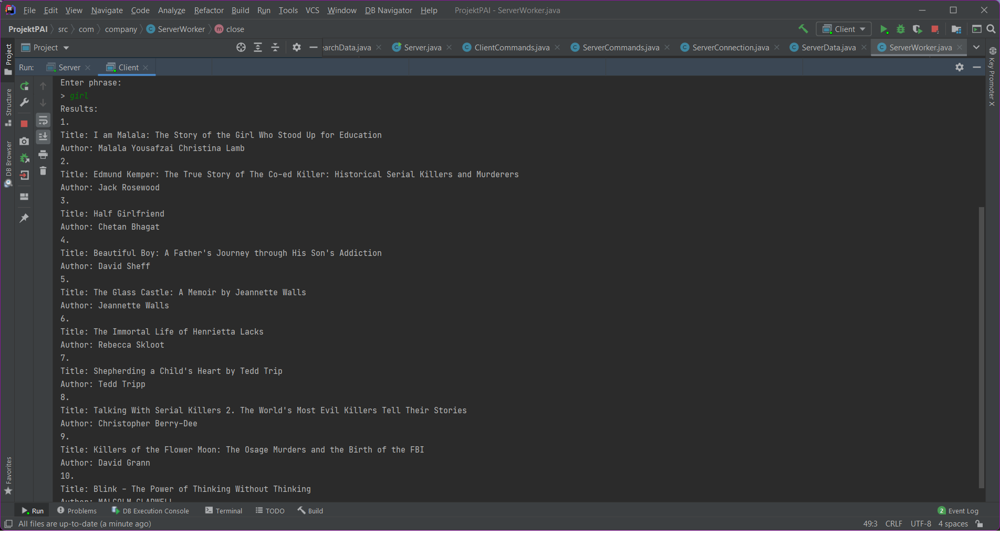
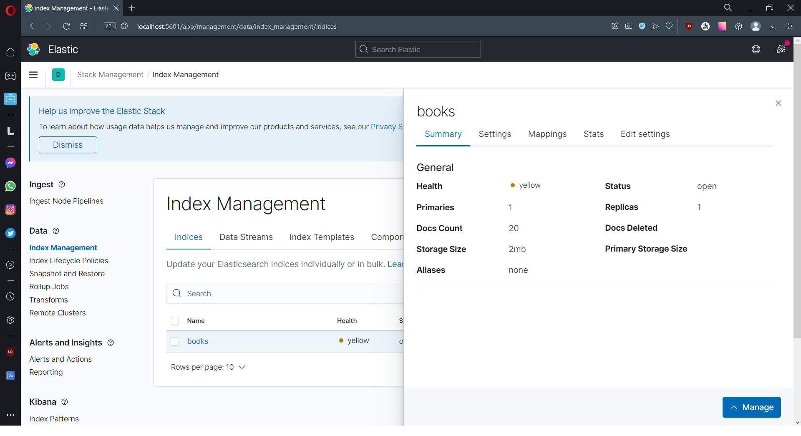

# Elastic Search Demo

Aplikacja demonstracyjna klient - serwer z użyciem Elasticsearch. 

### Wykorzystane technologie:

  
  
   
  

## Działanie aplikacji
[Do prawidłowego działania aplikacji wymagany jest Elasticsearch]

Aplikacja posiada część serwerową oraz kliencką. Próba uruchomienia klienta, gdy serwer nie będzie aktywny spowoduje wyrzucenie wyjątku oraz zakończenie programu. Po uruchomieniu serwera można uruchomić aplikację kliencką (serwer jest w stanie obsługiwać wielu podłączonych klientów). Klient po podłączeniu musi się zalogować na serwer przy pomocy loginu oraz hasła. Po zalogowaniu klient może użyć komendy /search, aby następnie zostać poproszonym o wpisanie frazy, której szuka. Po poprawnym wpisaniu, komenda zostanie przesłana na serwer, gdzie utworzy on połączenie dla konkretnego klienta z Elasticsearch, a następnie zwróci mu listę (maksymalnie 10) książek, które zawierają szukaną frazę (lub podobną w zależności od ustawień serwera).

W celu przetestowania aplikacji użyłem 20 różnych książek w formatach docx oraz pdf

## Screenshots

